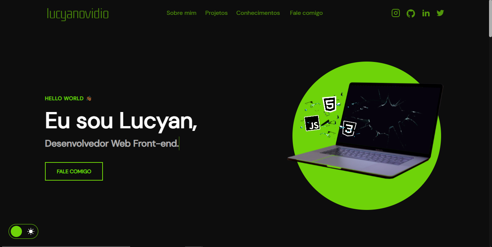

<h1 align="center">Portfólio - Gabriel Castro 💻</h1>

<h4 align="center"><a href="https://github.com/gabrielcastro9/portifolio">Confira o projeto aqui</a></h4>

---

## 💻 Sobre

Este projeto foi criado com o objetivo de me apresentar como desenvolvedor front-end, demonstrando minhas habilidades, experiência e paixão pela criação de interfaces web modernas, responsivas e intuitivas. Aqui, você poderá explorar exemplos do meu trabalho, conhecer um pouco mais sobre minha jornada profissional e entender como posso contribuir para o sucesso do seu próximo projeto.

## 🤯 O site é composto por:

- **Home:** Minha apresentação;
- **Sobre mim:** Um pouco sobre minha trajetória e meu estado atual;
- **Projetos:** Alguns projetos recentes que desenvolvi;
- **Conhecimentos:** As tecnologias que domino;
- **Fale comigo:** Área com meios para entrar em contato comigo;
- **Redes:** Minhas redes sociais disponíveis no menu de navegação e no rodapé do site.

## 🧠 Tecnologias utilizadas:

O site **ainda está em desenvolvimento**, pois estou em constante aprendizado. Mas até aqui utilizei as tecnologias:

    
    
    

## 📚 Alguns conceitos aplicados

Neste projeto apliquei os seguintes pontos:

- Semântica HTML;
- Pontos de acessibilidade;
- Responsividade;
- Mobile first;
- Utilização da lib JS <a href="https://scrollrevealjs.org">Scroll Reveal</a>.

---

<table>
  <tr>
    <td>
      
    </td>
    <td>
      Feito por <a href="https://www.linkedin.com/in/gabriel-de-castro-1602092bb/">Gabriel Castro.</a>
    </td>
  </tr>
</table>
